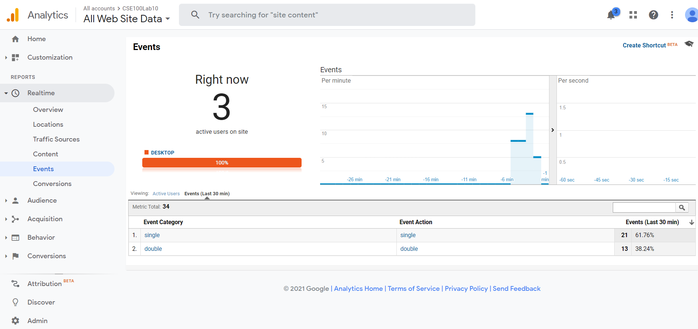
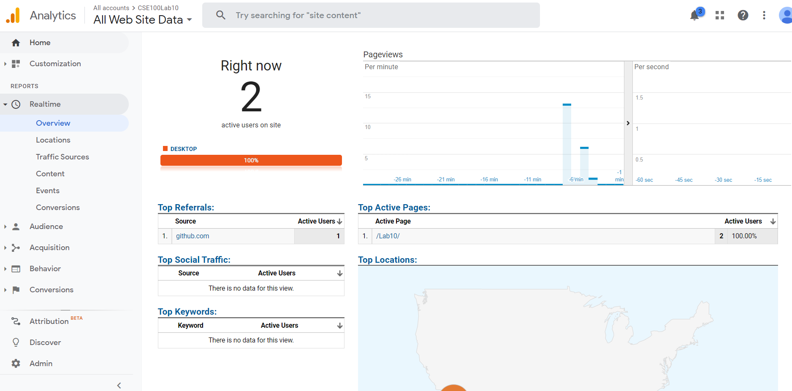

# Lab 10

Canny.io

https://cse110-lab10-thomas-gg.canny.io/

https://cse110-lab10-thomas-gg.canny.io/feature-requests

Pages

https://thomas-gg.github.io/Lab10/index.html

https://thomas-gg.github.io/Lab10/secondSplit.html

For the secondSplit I made the "Dark Mode feature" and it still is random whether there is a single or double column.

